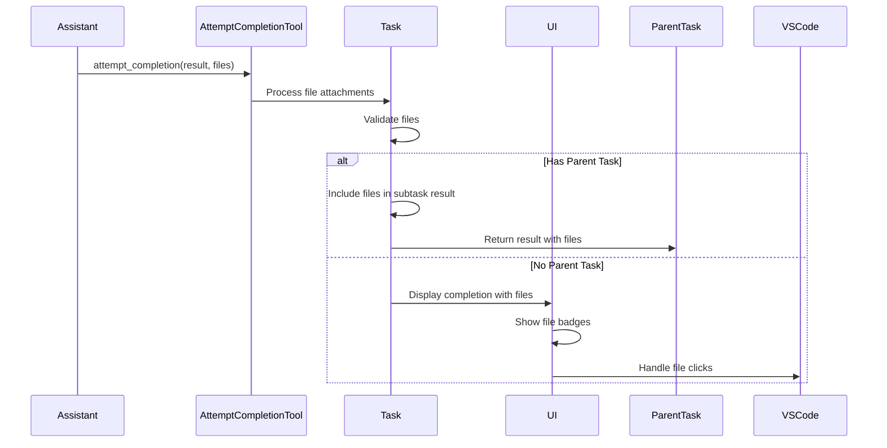

# File Attachments for attempt_completion Tool

## Overview

This design document outlines the implementation plan for adding file attachment support to the `attempt_completion` tool, allowing assistants to attach relevant files when completing tasks, including when a sub-task completes and returns files to its parent.

## Current Implementation Analysis

### File Attachment in new_task

- The `new_task` tool currently supports file attachments through the `files` parameter.
- File specifications are handled via the `AttachedFileSpec` interface in `shared/tools.ts`:

```typescript
interface AttachedFileSpec {
	path: string
	startLine?: number
	endLine?: number
}
```

- `newTaskTool.ts` parses a string representation of files into `AttachedFileSpec[]`.
- `ClineProvider.ts`'s `initClineWithTask` accepts `attachedFiles: AttachedFileSpec[]`.

## Files to Modify

### Core Files

1.  `src/shared/tools.ts`
    - Ensure `AttachedFileSpec` is suitable.
    - Add `files` to `toolParamNames`.
    - Modify `AttemptCompletionToolUse` interface.
2.  `src/core/prompts/tools/attempt-completion.ts`
    - Update tool description for `files` parameter.
    - Add files parameter documentation (XML format).
    - Update example usage to show file attachments.
3.  `src/core/tools/attemptCompletionTool.ts`
    - Implement `parseFileAttachments` utility (or use a shared one) to parse the XML `<files>` string into `AttachedFileSpec[]`, similar to `newTaskTool.ts`.
    - If validating files (existence, ranges), use `processFileForReading` from `src/shared/fileReadUtils.ts`.
    - Update completion response structure.
    - Modify `askFinishSubTaskApproval` flow: when a sub-task completes using `attempt_completion` with files, these files must be passed to `finishSubTask`.
4.  `src/core/task/Task.ts`
    - When a parent task resumes after a sub-task (which used `attempt_completion` with files) finishes:
        - The parent task needs to receive the `AttachedFileSpec[]` from the sub-task.
        - Update `resumePausedTask` or related logic to handle these incoming files.
        - The parent task should then incorporate these files into its subsequent tool result message to the LLM.
    - Consider how files attached at _completion_ of a task relate to the task's `this.attachedFiles` property.
5.  `src/core/webview/ClineProvider.ts`
    - Modify `finishSubTask(result: string, attachedFiles?: AttachedFileSpec[])`:
        - Update method signature to accept `attachedFiles`.
        - Ensure these files are correctly passed or made available to the resuming parent task.
6.  `src/core/assistant-message/presentAssistantMessage.ts`
    - Update `toolDescription` for `attempt_completion` if its output format changes due to files.
    - The `ClineMessage` for `subtask_result` (type: "say") might need to be augmented if it's to carry structured file information for UI display, or a new message type might be needed. Currently, it only handles text.

### UI Files

1.  `webview-ui/src/components/chat/ChatRow.tsx`
    - **`completion_result`**: Display file attachments provided directly by `attempt_completion`.
    - **`subtask_result`**: If a sub-task returns files, this message display needs to be enhanced to show these files, similar to `newTask` or `completion_result`. This depends on how `presentAssistantMessage.ts` structures the message.
    - Implement consistent file badge UI (clickable, shows path/range).
2.  `webview-ui/src/context/ExtensionStateContext.tsx`
    - Ensure state management can accommodate files attached at completion if necessary for UI state.

### Test Files

1.  `src/core/tools/__tests__/attemptCompletionTool.test.ts`
    - Test file attachment parsing.
    - Test file validation (if performed by the tool).
    - Test sub-task completion passing files to parent.
2.  `src/core/task/__tests__/Task.test.ts`
    - Test parent task resumption with files from sub-task.
3.  `src/core/webview/__tests__/ClineProvider.test.ts`
    - Test `finishSubTask` with `attachedFiles`.
4.  `webview-ui/src/components/chat/__tests__/ChatRow.test.tsx`
    - Test UI rendering for files in `completion_result` and `subtask_result`.

## Implementation Plan

### 1. Core Logic & Types

1. Update `shared/tools.ts` (interfaces, params)
2. Implement `parseFileAttachments` in `attemptCompletionTool.ts`
3. Modify `ClineProvider.ts#finishSubTask` to accept/pass files
4. Update `Task.ts#resumePausedTask` for handling files from sub-tasks
5. Update `attemptCompletionTool.ts` for parsing and file handling

### 2. Message Flow



### 3. UI/UX Considerations

1. File Preview
    - Display attached files in collapsible section
    - Show file names and line ranges
    - Syntax highlighting for code files
    - Consistent with `new_task` badges
2. Interaction
    - Clickable paths open in editor
    - Line range display
    - Copy content actions

### 4. Example Usage

```typescript
<attempt_completion>
<result>
Task complete! Updated the following files:
- Added test cases to routing
- Fixed validation logic
</result>
<files>
<file>test/routing.test.ts:25:50</file>
<file>src/validation.ts:10:30</file>
</files>
<command>npm run test</command>
</attempt_completion>
```

### 5. Security

1. Path Validation
    - Workspace-relative paths only
    - No directory traversal
    - Apply `.rooignore` rules
2. Size Limits
    - Maximum lines per file
    - Total files per response

### 6. Testing Strategy

1. Unit Tests
    - File parsing
    - Validation logic
    - Parent-child task communication
2. Integration Tests
    - Full round-trip with sub-tasks
    - UI rendering
    - File access
3. Security Tests
    - Path validation
    - Permission checks

## Migration

1. Add `files` parameter maintaining backward compatibility
2. Update documentation and examples
3. Add UI support incrementally
4. Monitor usage
